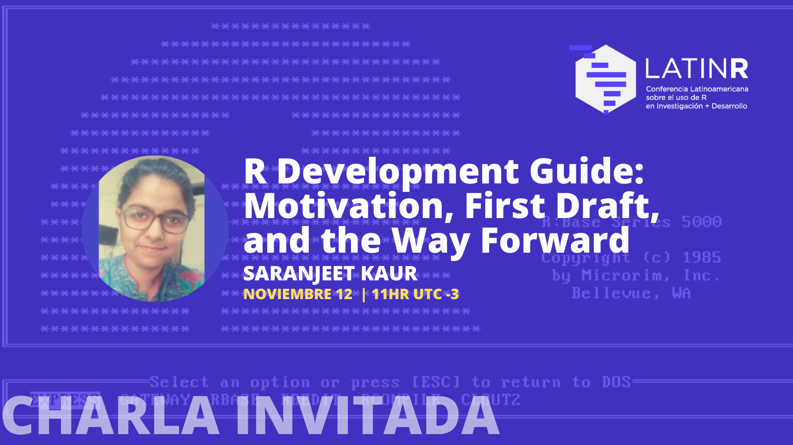
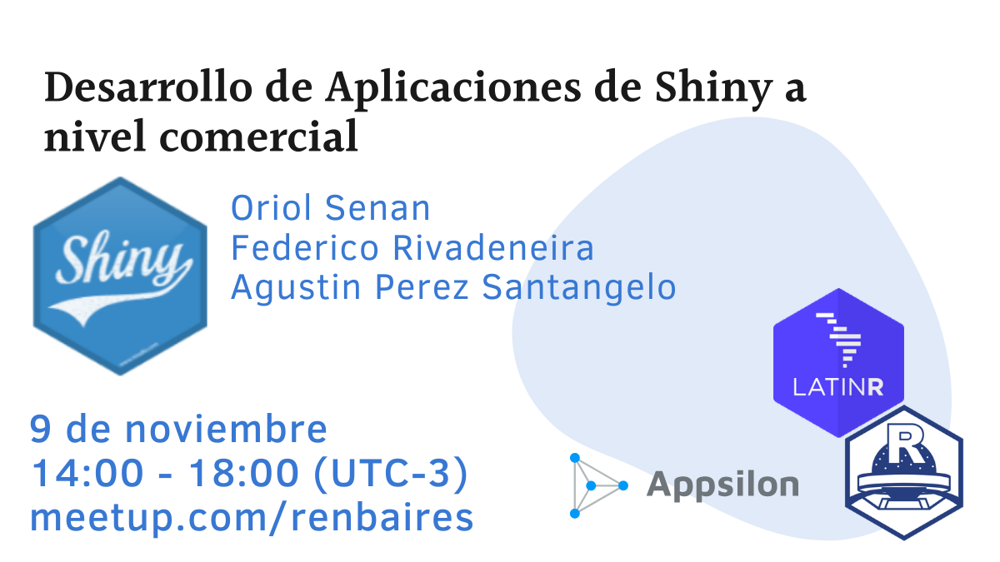
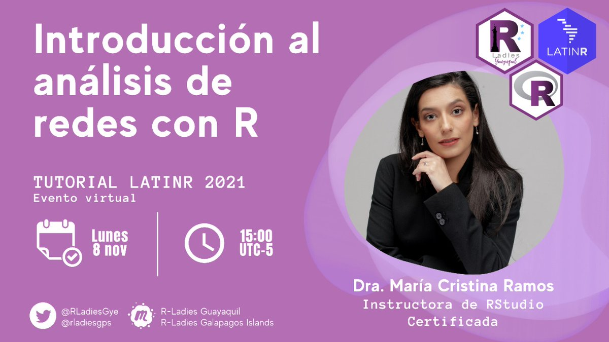
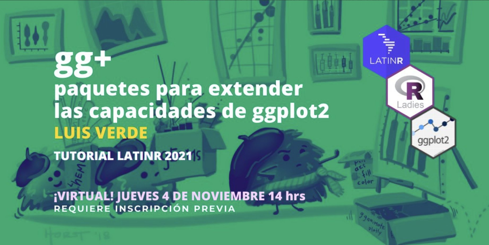
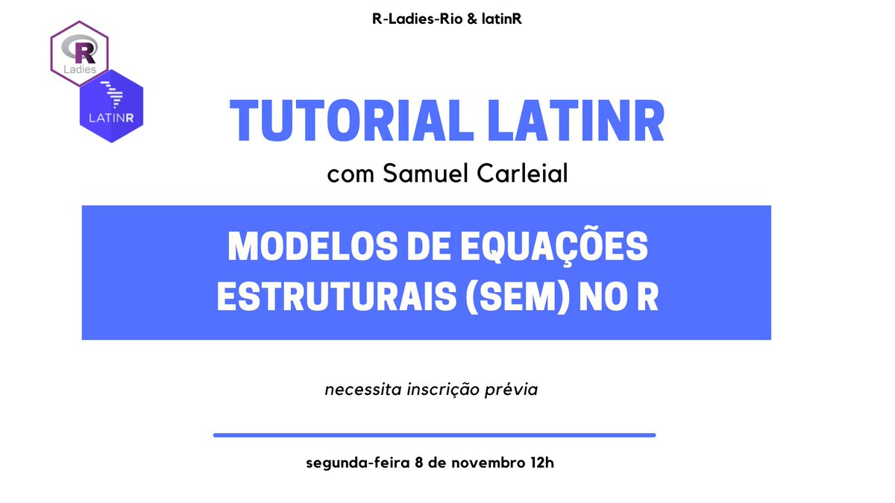

# Charlas invitadas, Contribuciones y Tutoriales LatinR 2021

1. [Charlas invitadas](#Charlas)
2. [Contribuciones](#Contribuciones)
4. [Tutoriales](#Tutoriales)

## Charlas

### Beautiful Tables in R by Tom Mock

* [Slides](https://jthomasmock.github.io/tables-latinr)
* [Code](https://t.co/GrZUrZdZtE?amp=1)
* [Video](https://youtu.be/Iu50SnrTW8A?t=2664)

### R Development Guide: Motivation, First Draft, and the Way Forward by Saranjeet Kaur 

* [Slides](https://github.com/SaranjeetKaur/LatinR2021_Slides_Invited_Talk)
* [Video](https://youtu.be/VzPia_PAxvw) 

_with subtitles in English and Spanish, con subtítulos en Inglés y en español_

## Contribuciones
### Desarrollo de paquetes - [sesion en vivo]()

* Divide y vencerás: de polAr al 'polArverse' - _Juan Pablo Ruiz Nicolini_ - [pdf](https://github.com/LatinR/presentaciones-LatinR2021/blob/main/contribuciones/LatinR2021_paper_11.pdf) - [video](https://youtu.be/5Cq8Kz4SYdY) 
* Paquete Calidad, para la evaluación de la precisión de estimaciones provenientes de encuestas de hogares - _Ricardo Pizarro and Klaus Lehmann_ - [pdf](https://github.com/LatinR/presentaciones-LatinR2021/blob/main/contribuciones/LatinR2021_paper_16.pdf) - [video](https://youtu.be/ch3bg2bhOmc)
* The `{botmaker}`: automatically build R-based bots, the result of creating the @RStatsJobsBot Twitter bot - _Juan Cruz Rodriguez_ - [pdf](https://github.com/LatinR/presentaciones-LatinR2021/blob/main/contribuciones/LatinR2021_paper_24.pdf) - [video](https://youtu.be/k7KL_YbtKpw)
* speech: extracción, disponibilización y análisis de discursos parlamentarios en Uruguay - _Elina Gómez , Nicolás Schmidt_ - [pdf](https://github.com/LatinR/presentaciones-LatinR2021/blob/main/contribuciones/LatinR2021_paper_35.pdf) - [video](https://youtu.be/Qn5MgyS55wE)

### Paquetes, modelos y aplicaciones en ciencias - [sesion en vivo]()

* AMALIA: R, shiny y minería de texto para el análisis masivo de archivos de la dictadura uruguaya - _Elina Gómez_ - [pdf](https://github.com/LatinR/presentaciones-LatinR2021/blob/main/contribuciones/LatinR2021_paper_12.pdf) - [video](https://youtu.be/mquWWrM8eqo) 
* Análisis de la Red de Investigadores del IESTA - _Pablo Mones and Ramón Álvarez-Vaz_ - [pdf](https://github.com/LatinR/presentaciones-LatinR2021/blob/main/contribuciones/LatinR2021_paper_22.pdf) - [video](https://youtu.be/Sq0Ia8Ww4-I)
* Políticas económicas frente al COVID-19: índice de Shannon para la diversidad de agendas de gobiernos locales - _Enrique García-Tejeda_ - [pdf](https://github.com/LatinR/presentaciones-LatinR2021/blob/main/contribuciones/LatinR2021_paper_25.pdf) - [video](https://youtu.be/7OX4A8Ikvno)
* Elaboración de redes analíticas interactivas con el paquete netCoin de R - _Modesto Escobar and Cristina Calvo López_ - [pdf](https://github.com/LatinR/presentaciones-LatinR2021/blob/main/contribuciones/LatinR2021_paper_36.pdf) - [video](https://youtu.be/ZGVb7GGvSOU)
* Retos y R en conteos rápidos electorales - _Maria Teresa Ortiz Mancera, Michelle Anzarut and Luis Felipe González Pérez_ - [pdf](https://github.com/LatinR/presentaciones-LatinR2021/blob/main/contribuciones/LatinR2021_paper_39.pdf) - [video](https://youtu.be/0Ort2iaJXKM)
* Análisis del tipo de consumo cultural según nivel socioeconómico de los beneficiarios del programa Pase Cultural - _Jonathan A. Modernel, Magdalena Cornejo_ - [pdf](https://github.com/LatinR/presentaciones-LatinR2021/blob/main/contribuciones/LatinR2021_paper_54.pdf) - [video](https://youtu.be/b18Zbp-yKeM)
* Análise exploratória de despesas com educação: avaliando impactos em um indicador de rendimento educacional - _Fernando Barbalho, Tiago Pereira, Lucas Leite, Jordão Gonçalves_ - [pdf](https://github.com/LatinR/presentaciones-LatinR2021/blob/main/contribuciones/LatinR2021_paper_31.pdf) - [video](https://youtu.be/RJpOEXh62TA)
* Desarrollo de una herramienta predictiva de calidad de agua para la gestión: modelos de machine learning + shiny - _Andrea Cardoso, Matías Muñoz Wolf, Juan José Lagomarsino, Lucía González-Madina, Mathias Bourel, Juan Pablo Pacheco, Rafael Terra, Gustavo Mendez, Néstor Mazzeo, Gonzalo Perera and Carolina Crisci_ - [pdf](https://github.com/LatinR/presentaciones-LatinR2021/blob/main/contribuciones/LatinR2021_paper_34.pdf) - [video](https://youtu.be/0L09y36yf08)

### Aplicaciones en salud pública - [sesion en vivo]()

* Uso de R en la validación de un modelo predictivo con aplicación a la enfermedad del asma - _Alejandra Tapia Silva_ - [pdf](https://github.com/LatinR/presentaciones-LatinR2021/blob/main/contribuciones/LatinR2021_paper_13.pdf) - [video](https://youtu.be/apiu01iYeL4) 
* Ciencia de datos con R con impacto en salud pública: una experiencia de uso de tidyverse para la detección de embarazos - _Sabrina Laura López, Carolina Mengoni Goñalons, María Cristina Nanton and Manuel Rodríguez Tablado_ - [pdf](https://github.com/LatinR/presentaciones-LatinR2021/blob/main/contribuciones/LatinR2021_paper_48.pdf) - [video](https://youtu.be/y6kcXVoFZ1k)
* ¿Por qué los funcionarios públicos de salud deberían saber R para analizar sus datos? - _Paulo Villarroel Tapia_ - [pdf](https://github.com/LatinR/presentaciones-LatinR2021/blob/main/contribuciones/LatinR2021_paper_61.pdf) - [video](https://youtu.be/y77nz9XBlXc)
* Estimating remaining life expectancy free of anxiety/depression in Argentina: trends and application of an alghoritmic stepwise decomposition for demographic change, 2005-18 - _Octavio Nicolas Bramajo_ - [pdf](https://github.com/LatinR/presentaciones-LatinR2021/blob/main/contribuciones/LatinR2021_paper_33.pdf) - [video](https://youtu.be/EDwLrPcxUFY)

### Enseñanza de R - [sesion en vivo]()

* Scaling feedback using learnr and gradethis in a introductory R course - _Beatriz Milz y Fernando Correa_- [pdf](https://github.com/LatinR/presentaciones-LatinR2021/blob/main/contribuciones/LatinR2021_paper_15.pdf) - [video](https://youtu.be/7v7XPtizdzU)
* Aplicaciones shiny para modelos de crecimiento de ecología de poblaciones: una propuesta simple y no simplista para animar al uso de R en cursos introductorios - _Lucía Rodríguez Planes_ - [pdf](https://github.com/LatinR/presentaciones-LatinR2021/blob/main/contribuciones/LatinR2021_paper_37.pdf) - [video](https://youtu.be/G2Hwe7XcT_4)
* Karel la robot enseña R: un paquete para la enseñanza de programación - _Marcos Prunello_ - [pdf](https://github.com/LatinR/presentaciones-LatinR2021/blob/main/contribuciones/LatinR2021_paper_45.pdf) - [video](https://youtu.be/sZze6Nl3bg8) 
* Un conjunto de paquetes para generar tutoriales interactivos para enseñar R - _Yanina Bellini Saibene_ - [pdf](https://github.com/LatinR/presentaciones-LatinR2021/blob/main/contribuciones/LatinR2021_paper_53.pdf) - [video](https://youtu.be/omU0uiuu1vE)

### Comunidad de R - [sesion en vivo]()

* Conociendo el camino para aprender a usar R en Latinoamérica: desafíos para promover la inclusión y diversidad - _Claudia Alejandra Huaylla, Paola Corrales, Andrea Gómez Vargas, Joselyn Chávez, Denisse Fierro Arcos, Virginia García Alonso_ - [pdf](https://github.com/LatinR/presentaciones-LatinR2021/blob/main/contribuciones/LatinR2021_paper_50.pdf) - [video](https://youtu.be/O31-2LHZDoM)
* Juntas podemos más, corta historia de cómo la pandemia nos incentivó a colaborar - _Denisse Fierro Arcos, Danisse María Carrascal Polo, Linda Jazmín Cabrera Orellana, Mary Jane Rivero Morales_ - [pdf](https://github.com/LatinR/presentaciones-LatinR2021/blob/main/contribuciones/LatinR2021_paper_43.pdf) - [video](https://youtu.be/MN2R0GxWJeE)

### Investigación y comunicación de resultados - [sesion en vivo]()

* Tablas reproducibles, presentables y con formato numérico local con gtsummary - _Eva Retamal Riquelme_ - [pdf](https://github.com/LatinR/presentaciones-LatinR2021/blob/main/contribuciones/LatinR2021_paper_56.pdf) - [video](https://youtu.be/6QTrzd2Wxrs) 
* Uso de R y Youtube para reporte de protocolos: experiencia en laboratorio de física de suelos - _Cristina Contreras, Sara Acevedo, Maria Jesús Melej, Edouard Acuña, Carolina Giraldo, Carlos Ávila and Carlos Bonilla_ - [pdf](https://github.com/LatinR/presentaciones-LatinR2021/blob/main/contribuciones/LatinR2021_paper_29.pdf) - [video](https://youtu.be/tLDix5tBPHE)
* Un viaje a la ecología del movimiento a través de la minería de texto - _Rocío Joo, Simona Picardi, Matthew E. Boone, Thomas A. Clay, Samantha C. Patrick, Vilma S. Romero-Romero, Mathieu Basille_ - [pdf](https://github.com/LatinR/presentaciones-LatinR2021/blob/main/contribuciones/LatinR2021_paper_49.pdf) - [video](https://youtu.be/nUlmL2eEUII)

### Datos espaciales - [sesion en vivo](https://youtu.be/Iu50SnrTW8A)

* Soy naturalista y quiero pasear en mi país, ¿dónde hay más oportunidades de llenar vacíos de información? - _Florencia Grattarola, Juan Manuel Barreneche_ - [pdf](https://github.com/LatinR/presentaciones-LatinR2021/blob/main/contribuciones/LatinR2021_paper_28.pdf) - [video](https://youtu.be/8qltR0p_Czg) 
* Un cuento digital desde R: cómo crear un relato situado con Leaflet - _Natalia Morandeira_ - [pdf](https://github.com/LatinR/presentaciones-LatinR2021/blob/main/contribuciones/LatinR2021_paper_42.pdf) - [video](https://youtu.be/QM0WwPdjK2w)

### Periodismo de datos, datos abiertos y visualización - [sesion en vivo](https://youtu.be/Iu50SnrTW8A?t=6853)

* JFemDados: democratizando informação - _Matheus Valentim e Marcello Filgueiras_ - [pdf](https://github.com/LatinR/presentaciones-LatinR2021/blob/main/contribuciones/LatinR2021_paper_57.pdf) - [video](https://youtu.be/M5fMaXnIbEg) 
* A Base dos Dados+: acesso fácil a dados públicos de qualidade - _Rodrigo Dornelles , Matheus Valentim , Fernanda Scovino , Pedro Cavalcante_ - [pdf](https://github.com/LatinR/presentaciones-LatinR2021/blob/main/contribuciones/LatinR2021_paper_52.pdf) - [video](https://youtu.be/d2mPTI6-KmE)
* Alavancando o poder do RMarkdown com as linguagens da Web e D3.js para produzir histórias de dados envolventes sobre finanças públicas - _Tiago Pereira, Fernando Barbalho, Jordao Goncalves and Lucas Leite_ - [pdf](https://github.com/LatinR/presentaciones-LatinR2021/blob/main/contribuciones/LatinR2021_paper_58.pdf) - [video](https://youtu.be/898kfaJhv5Q) 
* Collect and use open access World Bank data to know your country - _Bruno Thiago Tomio_ - [video](https://youtu.be/bRzNlxZbi0o)

### R en producción, computación y flujos de trabajo - [sesion en vivo]()

* R en producción: aprendizajes, retos y mejores prácticas - _Ángel Escalante , Nancy Morales_ - [pdf](https://github.com/LatinR/presentaciones-LatinR2021/blob/main/contribuciones/LatinR2021_paper_5.pdf) - [video](https://youtu.be/OLDgTVa2vrw) 
* Analogsea: using R for big data analytics - _Mauricio Vargas, Scott Chamberlain, Hadley Wickham and Bob Rudis_ - [pdf](https://github.com/LatinR/presentaciones-LatinR2021/blob/main/contribuciones/LatinR2021_paper_46.pdf) - [video](https://youtu.be/ZBOaPuhVzqg)
* IBM Cloud Functions com R - _Thiago Pires_ - [pdf](https://github.com/LatinR/presentaciones-LatinR2021/blob/main/contribuciones/LatinR2021_paper_59.pdf) - [video](https://youtu.be/eIww0bf4b9g)
* Más velocidad y menos colapsos: preprocesamiento de archivos con utilidades del sistema operativo - _Luis Verde_ - [pdf](https://github.com/LatinR/presentaciones-LatinR2021/blob/main/contribuciones/LatinR2021_paper_55.pdf) - [video](https://youtu.be/jQRQ31jCi24)
* Uso de R como front-end en un datawarehouse de gestión académica universitaria - _Daniel Alessandrini, Pablo Martínez, Óscar Montañés, Juan Manuel Serralta_ - [pdf](https://github.com/LatinR/presentaciones-LatinR2021/blob/main/contribuciones/LatinR2021_paper_10.pdf) - [video](https://youtu.be/GSBQbZk_Zrw)

### Desarrollo de paquetes y modelos - [sesion en vivo]()

* missMSPC: un paquete de herramientas gráficas para aplicar MSPC con datos faltantes - _Julia Inés Fernández , Diego Marfetán Molina , José Alberto Pagura , Marta Beatriz Quaglino_ - [pdf](https://github.com/LatinR/presentaciones-LatinR2021/blob/main/contribuciones/LatinR2021_paper_7.pdf) - [video](https://youtu.be/C3lhkGkarp0) 
* QR: un paquete para la factorización QR sin rotación - _Juan Claramunt González_ - [pdf](https://github.com/LatinR/presentaciones-LatinR2021/blob/main/contribuciones/LatinR2021_paper_32.pdf) - [video](https://youtu.be/l4JpN9UyA0Y)
* Estimación de un modelo computacional mediante computación Bayesiana Aproximada - _Juan Ignacio Baccino Costa , Mauro Loprete , Alvaro Valiño , Daniel Ciganda_ - [pdf](https://github.com/LatinR/presentaciones-LatinR2021/blob/main/contribuciones/LatinR2021_paper_8.pdf) - [video](https://youtu.be/fFXMNv5Gg-k)
* Feature and variable selection in complex data classification - _Manuel Oviedo de la Fuente, Manuel Febrero Bande_  - [pdf](https://github.com/LatinR/presentaciones-LatinR2021/blob/main/contribuciones/LatinR2021_paper_63.pdf) - [video](https://youtu.be/qSQoUrYDLbE)
* Optimizando @RStatsJobsBot: un modelo de aprendizaje automático para clasificar tweets de ofertas de empleo -_Martin Rodriguez Nuñez, Juan Cruz Rodriguez_ - [pdf](https://github.com/LatinR/presentaciones-LatinR2021/blob/main/contribuciones/LatinR2021_paper_23.pdf) - [video](https://youtu.be/CCUSaaI6ZJw)
* Como implementar algunos modelos de imputación múltiple para datos de panel - _	Ramón Álvarez-Vaz, Diana Del-Callejo-Canal, Margarita Edith Canal-Martínez, Elena Vernazza and Alar Urruticoechea_ - [pdf](https://github.com/LatinR/presentaciones-LatinR2021/blob/main/contribuciones/LatinR2021_paper_20.pdf) - [video](https://youtu.be/iUKOp65SVCw)
* Años potenciales de vida perdidos por siniestros de tránsito en Uruguay - _Gonzalo De armas , Mauro Loprete , Ramón Álvarez-Vaz_ - [pdf](https://github.com/LatinR/presentaciones-LatinR2021/blob/main/contribuciones/LatinR2021_paper_6.pdf) - [video](https://youtu.be/_7K6oIl-7Io)

### Desarrollo de paquetes y aplicaciones en ciencia - [sesion en vivo]()

* agromet: un paquete para el análisis de datos meteorológicos - _Natalia Gattinoni, Paola Corrales, Elio Campitelli, Yanina Bellini y Gabriel Rodriguez_ - [pdf](https://github.com/LatinR/presentaciones-LatinR2021/blob/main/contribuciones/LatinR2021_paper_26.pdf) - [video](https://youtu.be/M8ALCz62B4U)
* Rocc: gestão e análise de dados de ocorrências de espécies - _Sara Mortara and Andrea Sánchez-Tapia_ - [pdf](https://github.com/LatinR/presentaciones-LatinR2021/blob/main/contribuciones/LatinR2021_paper_51.pdf) - [video](https://youtu.be/y2Y15ri78Mk)
* Interoperabilidad y grandes volúmenes de datos: como potenciar el diseño de políticas públicas basada en evidencia - _	Juan Pablo Zumárraga, Fernando Ashbey, Julieta Coll and Adrian Ibarra_ - [pdf](https://github.com/LatinR/presentaciones-LatinR2021/blob/main/contribuciones/LatinR2021_paper_60.pdf) - [video](https://youtu.be/FvW6Zfc-M6o)
* Aplicación de R para analizar la perspectiva del consumidor sobre la consistencia de alimentos - _Franco Della Fontana, Margarita Armada and María Cristina Goldner_ - [pdf](https://github.com/LatinR/presentaciones-LatinR2021/blob/main/contribuciones/LatinR2021_paper_14.pdf) - [video](https://youtu.be/PTyZDT2oLBA)
* Ensembles conformacionales de Proteínas Intrínsecamente Desordenadas moldean las velocidades de evolución dando origen a patrones conformacionales - _Julia Marchetti, Nicolas Palopoli, Alexander Miguel Monzon, Diego Javier Zea, Maria Silvina Fornasari, Silvio C.E. Tosatto and Gustavo Parisi_ - [pdf](https://github.com/LatinR/presentaciones-LatinR2021/blob/main/contribuciones/LatinR2021_paper_41.pdf) - [video](https://youtu.be/N-hm2OM9eyQ)

### Charla de Sponsor

* Desarrollo comercial de aplicaciones en Shiny (AppSilon) - _Federico Rivandeira_ - [video](https://youtu.be/zl5hR0SsBto)

## Tutoriales  

### Desarrollo de Aplicaciones de Shiny a nivel comercial 

Nuestro sponsor AppSilon presenta este tutorial para iniciarse en el desarrollo de Aplicaciones de Shiny a nivel comercial  

* [Slides introducción](https://github.com/LatinR/presentaciones-LatinR2021/blob/main/tutoriales/LatinR%20%5B2021%5D%20Intro.pdf)
* [Slides modulos](https://github.com/LatinR/presentaciones-LatinR2021/blob/main/tutoriales/LatinR%20-%20Modulos.pdf)
* [Slides estructuras](https://github.com/LatinR/presentaciones-LatinR2021/blob/main/tutoriales/LatinR%20-%20Estructura.pdf)
* [Proyecto performance](https://github.com/LatinR/presentaciones-LatinR2021/blob/main/tutoriales/performance.zip)
* [Proyecto modulos](https://github.com/LatinR/presentaciones-LatinR2021/blob/main/tutoriales/latinr_appsilon_modulos.zip)

* [Video]()

### "Introducción al análisis de redes con R" 

La Dra. María Cristina Ramos, es socióloga y científica de redes. Utiliza la ciencia de las redes para estudiar una amplia gama de temas, incluidas las redes de colaboración, los sistemas socioecológicos, el análisis de textos, los contactos personales y la salud, y los modelos mentales de creencias. Ella es consultora independiente e instructora de RStudio Certificada. Puedes seguirla en Twitter, @mariacramosf, o por su página web: https://mariacramos.com/

* [Slides](https://mcramosf.github.io/intro_nets_LatinR_slides/Intro_Nets_slides.html#1)
* [Archivos RMarkdown](https://github.com/mcramosf/intro_sna_LatinR)
* [Hoja de repaso de visualización](https://www.nceas.ucsb.edu/sites/default/files/2020-04/colorPaletteCheatsheet.pdf)
* [Evaluación](https://duke.qualtrics.com/jfe/form/SV_6hht2z2C0a93hvo)
* [Video](https://youtu.be/rMozkn_Dvps)

### "gg+: paquetes para extender las capacidades de ggplot2" 

Una visita guiada por ~10 paquetes que añaden nuevas capas (geoms), colores, o funcionalidades a ggplot2. Demostración de funciones que nos permitirán elaborar figuras más eficientes y llamativas.

* [Material](https://luisdva.github.io/ggmas/#1)
* [Video](https://youtu.be/R0Sj0qz3o4g)

### "Modelos de equações estruturais (Structural Equation Models; SEM) in R" 

Modelos de equações estruturais são um conjunto de técnicas usados para representar hipóteses acerca de um estudo/conjunto de dados em termos de parâmetros estruturais e com base num embasamento teórico. Estas técnicas são bastante usadas em Ciências Sociais e Biológicas ou em Psicologia, a exemplo por meio de "path analysis" (análise de caminhos), "mediation analysis" (análise de mediação) ou "latent variable analysis" (análise de variáveis latentes). Neste tutorial, será feita uma breve introdução no tópico, junto a exemplos de estudos prévios. Logo, o participante terá a oportunidade de aprender na prática como produzir e interpretar tais models em R, com diferentes exercícios. Participantes podem trazer seus próprios dados e compartilhar suas próprias experiências. 

* [Material]()
* [Video]()
